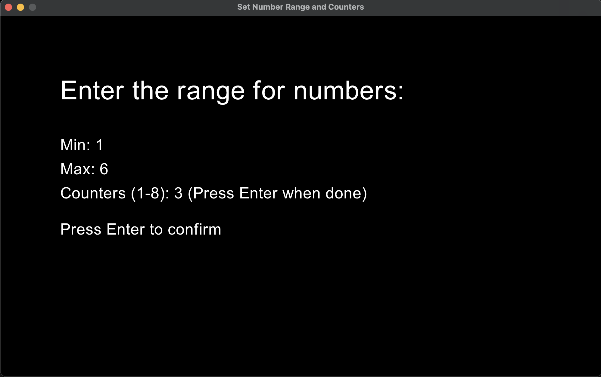
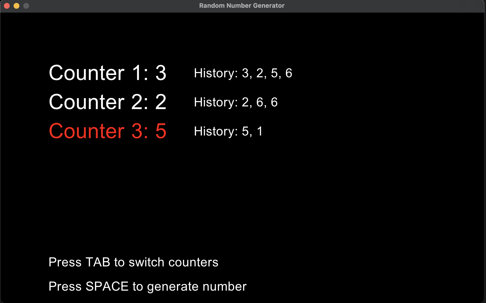

# Random Number Generator with Multiple Counters

This is a simple Ruby application built using the Gosu library. The app allows users to generate random numbers within a specified range, with up to 8 counters. Each counter maintains a history of the numbers generated for it, and users can switch between counters using the `Tab` key.

## Features

- **Range Selection**: Set the minimum and maximum values for the random number generator.
- **Multiple Counters**: Choose up to 8 counters, each with its own random number history.
- **Number History**: Each counter maintains a history of the numbers generated for it.
- **Keyboard Controls**: 
  - `Tab`: Switch between counters.
  - `Space`: Generate a random number for the selected counter.
  - `Backspace`: Delete the last digit entered when setting the range or counters.
  - `Enter`: Confirm the entered values and proceed to the next step or start the random number generator.

## Getting Started

### Prerequisites

- **Ruby**: Make sure Ruby is installed on your system.
- **Gosu Gem**: The app uses the Gosu library, which you can install via RubyGems:

```bash
gem install gosu
```

### Running the App

1. **Clone the Repository**:

```bash
git clone https://github.com/brianbutton/randomnumber.git
cd randomnumber
```

2. **Run the Application**:

```bash
ruby StartScreenApp.rb
```

### How to Use

1. **Start Screen**:
   - The app begins with a start screen where you will input:
     - **Min Value**: The lower bound of the random number range.
     - **Max Value**: The upper bound of the random number range.
     - **Number of Counters**: How many counters you want (up to 8).

2. **Random Number Generator Screen**:
   - Use the `Tab` key to cycle through counters. The selected counter is highlighted in red.
   - Press the `Space` key to generate a random number for the selected counter.
   - The history of generated numbers for each counter is displayed on the screen.

## File Structure

- **StartScreenApp.rb**: Handles the initial user inputs for the range and the number of counters.
- **RandomNumberApp.rb**: Contains the logic for the random number generator, handling multiple counters and maintaining their histories.

## Screenshots

### Start Screen

*Caption: The initial screen where users input the range and number of counters.*

### Random Number Generator Screen

*Caption: The main screen showing multiple counters and generated random numbers.*

## Contributing

Feel free to submit issues or pull requests if you have any improvements or suggestions!

## Acknowledgments

- Built with [Gosu](https://www.libgosu.org/), a 2D game development library for Ruby and C++.
